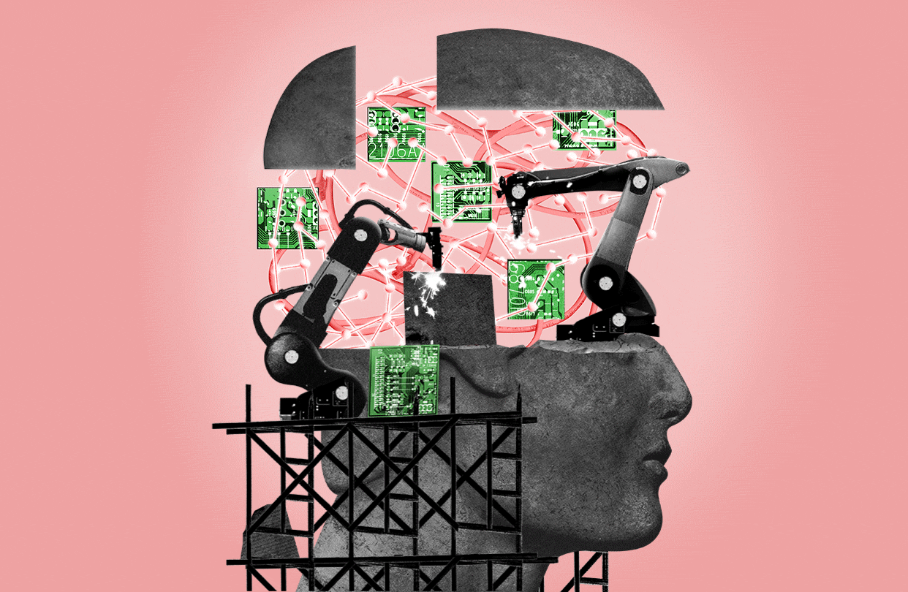

# CS 198-96: Introduction to Neurotechnology (Fall 2020)

Welcome to CS 198-96: Intro to Neurotechnology! This course is run by the Education branch of [Neurotechnology @ Berkeley](https://neurotech.berkeley.edu).

<!-- ### Syllabus

[Syllabus](https://docs.google.com/document/d/1kKtiD6YWtURetEiy9AScyJoVWdasE68gR3KoMo3y4c4/edit?usp=sharing) -->

### Meet the Team

- [Deven Navani](https://linkedin.com/in/devennavani), VP of Education 
- [Amy Wang](https://www.linkedin.com/in/amywang58/), co-head of Education
- [Izzy Baldacci](https://www.linkedin.com/in/isabella-baldacci-74694519a/), co-head of Education
- [Haya Halabieh](https://www.linkedin.com/in/haya-halabieh-145941187/), content
- [Sooyeon Oh](https://www.linkedin.com/in/sooyeonoh/), content
- [Julie Nemerson](https://www.linkedin.com/in/julie-nemerson/), content
- [Milan Filo](https://www.linkedin.com/in/milan-f-b2a861110/), content
- [Abhinav Gundrala](), content
- [Czarinah Micah Rodriguez](), content

<h2>Module 1: The Big Picture</h2>
<h3>Section 1: What is neurotechnology?</h3>
<ul>
<li>Lesson 1: Neuroimaging <a href="https://docs.google.com/presentation/d/1FLcFBmpc2SduGUlvaqIIVNP73g3SqXxtOQfYx4R1_zc/edit?usp=sharing">(slides)</a> <a href="https://www.youtube.com/watch?v=9dqbn927S3Q&list=PL1ukmPI3TksPBugenpeLF10jjRXR0upOy&index=1">(video)</a></li>
<li>Lesson 2: Neuromodulation/Neurostimulation</li>
<li>Lesson 3: Brain-Computer Interfaces</li>
</ul>
<h3>Section 2: Why neurotechnology?</h3>
<ul>
<li>Lesson 4: Treat Neurological Disorders <a href="https://docs.google.com/presentation/d/1BfXXm0zDFGwfjLA8FDBKrkVQtKBiui-YOsA0MVTPLUw/edit?usp=sharing">(slides)</a> <a href="https://www.youtube.com/watch?v=hbYmDV1qEO8&list=PL1ukmPI3TksPBugenpeLF10jjRXR0upOy&index=2">(video)</a></li>
<li>Lesson 5: Understand the Brain <a href="https://docs.google.com/presentation/d/1qwlHM70bX7x82NIF32sRuV5GQbhZ473k9PvD69Mo6xk/edit?usp=sharing">(slides)</a> <a href="https://www.youtube.com/watch?v=V9uGlDig3f4&list=PL1ukmPI3TksPBugenpeLF10jjRXR0upOy&index=3">(video)</a></li>
<li>Lesson 6: Device Control <a href="https://docs.google.com/presentation/d/1IUP46SJQ0g8ckVMw2GMInaHannvMkQEU2Ny7gA75Cm0/edit?usp=sharing">(slides)</a> <a href="https://www.youtube.com/watch?v=Sk5JtpEU67I&list=PL1ukmPI3TksPBugenpeLF10jjRXR0upOy&index=4">(video)</a></li>
<li>Lesson 7: Human Augmentation <a href="https://docs.google.com/presentation/d/1CBYZXTknupmbC8VKwkMfRtCNJ7JAw1PdzKNDsTI-O-U/edit?usp=sharing">(slides)</a> <a href="https://www.youtube.com/watch?v=UrrycI5DGkw&list=PL1ukmPI3TksPBugenpeLF10jjRXR0upOy&index=5">(video)</a></li>
</ul>
<h3>Section 3: Technologies and Key Players</h3>
<ul><li>Lesson 8: Electroencephalography (EEG)</li><li>Lesson 9: Electromyography (EMG)</li><li>Lesson 10: Magnetic Imaging</li><li>Lesson 11: Invasive Approaches</li></ul>
<h3>Section 4: Challenges</h3>
<ul><li>Lesson #12: Bandwidth</li><li>Lesson 13: Implantation</li><li>Lesson 14: Neuroscience knowledge gaps</li><li>Lesson 15: Public Skepticism and Ethics</li></ul>

<h2>Module 2: Neuroscience</h2>
<h3>Section 1: Neuroscience Systems</h3>
<ul><li>Lesson 1: The Nervous System</li><li>Lesson 2: Technology that lets you do stuff to the brain</li><li>Lesson 3: Technology that lets you do stuff with the brain</li></ul>
<h3>Section 2: Action Potentials</h3>
<ul><li>Lesson 4: Clinical Medicine</li><li>Lesson 5: Cognitive Neuroscience</li><li>Lesson 6: Device Control</li><li>Lesson 7: Enhancement</li></ul>
<h3>Section 3: Sensory Systems</h3>
<ul><li>Lesson 8: Electroencephalography (EEG)</li><li>Lesson 9: Electromyography (EMG)</li><li>Lesson 10: Magnetic Imaging</li><li>Lesson 11: Invasive Approaches</li></ul>
<h3>Section 4: Motor Systems</h3>
<ul><li>Lesson #12: Bandwidth</li><li>Lesson 13: Implantation</li><li>Lesson 14: Neuroscience knowledge gaps</li><li>Lesson 15: Public Skepticism and Ethics</li></ul>

### Spring 2020 Lectures

- Lecture 1: The Big Picture [(slides)](https://docs.google.com/presentation/d/18uCmsE90HPA1_8xNekUP94K5ErNxOS5hffchtTHXlLg/edit?usp=sharing) [(webcast)](https://www.youtube.com/watch?v=JWnHp_lqkKY) 
- Lecture 2: Macro Neuroscience [(slides)](https://docs.google.com/presentation/d/1qf8d9TegBbjmpbiEGmMCCupMV_R1GzlB0OUxH956umc/edit?usp=sharing) [(webcast)](https://youtu.be/IY02T5WzCpw)
- Lecture 3: Micro Neuroscience [(slides)](https://docs.google.com/presentation/d/1v1lizm3QJqGZx0vuf2hYUl0MvI9G786ZRvUn52kutPk/edit?usp=sharing) [(webcast)](https://youtu.be/FT_gtKjSTQQ)
- Lecture 4: Brain Imaging Techniques [(slides)](https://docs.google.com/presentation/d/1Xx8Ssu3ZhAqTyweJZJMXOBT8urqL5kGnCppBIxzM3SM/edit?usp=sharing) [(webcast)](https://youtu.be/rsP_Obn7JKU)
- Lecture 5: Introduction to Signal Processing [(webcast)](https://youtu.be/gURGgMwAoDM)
- Lecture 6: Introduction to Machine Learning
- Lecture 7:
- Lecture 8: 
- Lecture 9: 
- Lecture 10: Clinical Applications [(slides)](https://docs.google.com/presentation/d/1I5xrWjetjQesf7aAzMJwKvL0yQG4yI6IxYkVmpix4oM/edit?usp=sharing) [(webcast)](https://youtu.be/OmwgQUC69mc)
- Lecture 11: Neuroethics [(slides)](https://docs.google.com/presentation/d/1Q0yCELR0dzq3aViE_IOU7gFfSs_s-NZVFGVRqwjsBjk/edit?usp=sharing) [(webcast)](https://youtu.be/ftGm5tj6QMg)
- Lecture 12: Current State of the Field [(webcast)](https://youtu.be/T9HmHf7EPms)

<!-- ### Labs

- [Lab 1: Getting started with EEG](http://docs.openbci.com/Tutorials/02-Ganglion_Getting%20Started_Guide)
- Lab 2: Sensory extension
- [Lab 3: Detecting event-related potentials](lab3)
- [Lab 4: Neurofeedback](lab4)
- [Lab 5: Steady-state visually evoked potentials](lab5)
- [Lab 6: Detecting stress using biosignals](lab6)
- [Lab 7: Measuring attention using cross-brain correlations](lab7)
- [Lab 8: Detecting and controlling muscle movements](lab8)
- [Lab 9: Characterizing EEG responses to smell](lab9) -->
